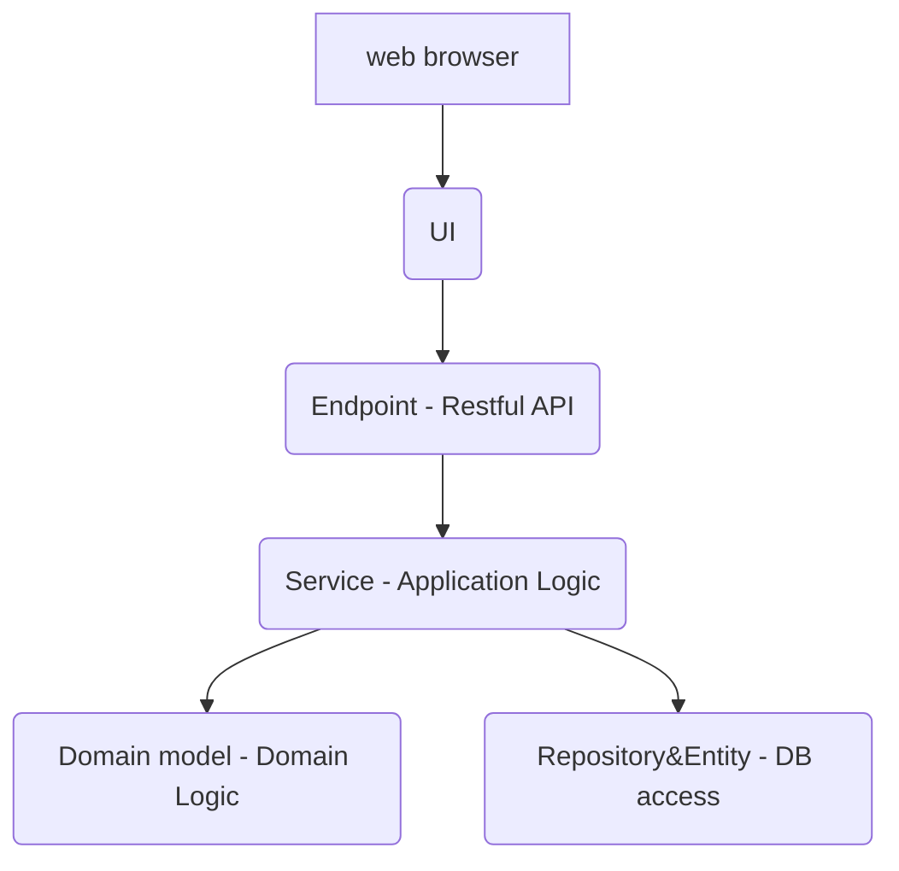

## Spring boot 1.5.x 模版工程
- 编程语言 Java 8 
- 整体框架 [Spring Boot 1.5.x 的最新版](https://projects.spring.io/spring-boot/)
- 选择spring mvc作为Restful API实现
- 关系型数据库访问层：Spring Data JPA
  
### Resful API 一览
参考所有Controller结尾的类

### 工程内部功能层次结构图

Two type of business logic 
Domain logic: pure logic of the business domain
E.g., calculating revenue recognitions of a contract
Application logic: application responsibilities
E.g., notifying administrators and integrated applications, of revenue recognition calculations

- Service Layer is a good spot to place transaction control and security.
- Service 中的一个public方法直接对应一个user case


### 工程目录（package）结构采用Folder-by-feature风格
从提高代码可读性角度考虑，建议使用业务功能划分目录结构，例如：

```
com.example.myproject （基础目录 base package）
├── MyApplication.java
├── features （第一层目录，表示下面都是业务模块）
│   ├── pet （第二层目录，某业务逻辑含义的模块名）
│   │   ├── PetController.java  （如果Restful层用spring mvc就是XyzController，如果用Jersey就是XyzEndpoint）
│   │   ├── PetService.java （是业务对象方法的调用方，串联方。一个public方法对应一个Usecase）
│   │   ├── PetDomain.java  （业务对象，包含业务数据与业务规则）
│   │   ├── PetEntity.java  （表数据对应的对象）
│   │   └── PetRepo.java    （数据库访问）
│   ├── user 
│   │   ├── UserController.java
│   │   ├── UserService.java
│   │   ├── UserDomain.java
│   │   ├── UserEntity.java   
│   │   └── UserRepo.java
│   ├── shared
│       ├── exception
│       │   ├── AppException.java 
│       └── Constants.java （共用的常量，枚举型变量等等）
├── utils （util中不能包含业务逻辑代码）
│   ├── ConfigFileUtils.java
│   ├── MailUtils.java
│   └── ImageUtils.java 
│
```

不要使用controller, service, repository 等功能层次作为package的名字。 这种划分方式仅适合微型项目。package是一种划分模块的方式，需要遵循高内聚，松耦合的规则。设计package的同时也可以帮助开发人员区分业务模块。
project's directory structure shouldn't tell me that it's an MVC application. It should tell me that it's a store front, or a time off request system, or whatever. The high level structure and architecture should tell us about what this thing is, not how it was implemented.

参考说明：https://hackernoon.com/package-by-features-not-layers-2d076df1964d


## 如何运行
### 启动参数
本地debug直接启动MyApplication。 本系统外部只依赖MySQL数据库。

### docker compose
可以通过docker compose 启动本地环境，启动命令参考 build_image.sh。
docker compose配置文件在目录/docker-compose下。

docker-compose up -d
docker-compose down

### build命令
gradle build
或忽略UT
gradle build -x test

### 参考资料
- [Spring Boot官方文档](https://www.gitbook.com/book/qbgbook/spring-boot-reference-guide-zh/details)
- [JPA 关联查询](https://www.jianshu.com/p/cc4e199cbb14)

